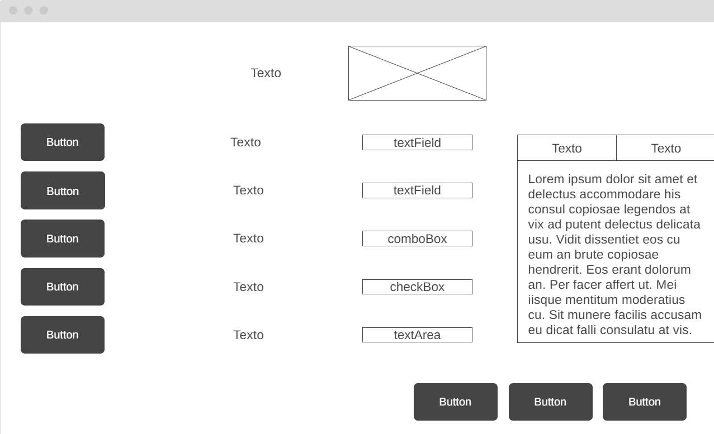
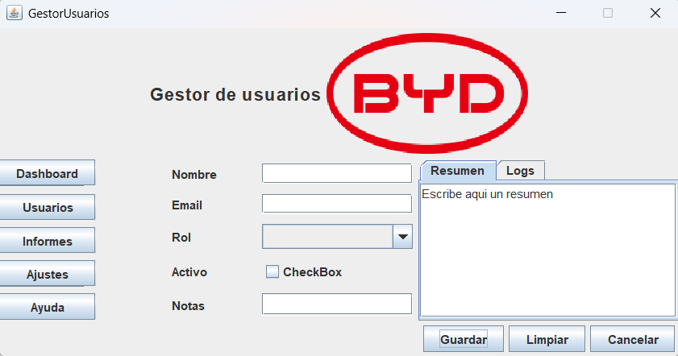
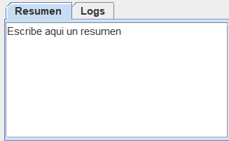
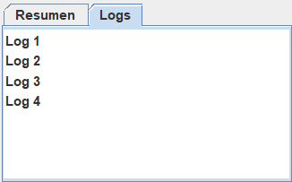

# 🖥️ Ejercicio Tema 2: Paneles y Layouts como profesionales  

Este proyecto consiste en diseñar e implementar una interfaz gráfica en Java Swing a partir de un **wireframe** y un **árbol de contenedores**.  
El objetivo es practicar con los distintos **layouts** disponibles en Swing: `BorderLayout`, `FlowLayout`, `GridLayout` y `GridBagLayout`, además de crear un `JDialog` modal.  

---

## 🎯 Objetivos

- Dominar la elección y combinación de distintos layouts en una misma ventana.  
- Construir un **Gestor de usuarios** con estructura clara y adaptable al redimensionar.  
- Practicar el diseño de un `JFrame` principal y un `JDialog` modal.  
- Cumplir los resultados de aprendizaje **RA1** y **RA4**.  

---

## 📝 Wireframe

👉 Aquí se incluye el **Wireframe** de la interfaz:  

  

---

## 🌳 Árbol de contenedores

JFrame (BorderLayout)
├─ NORTH: headerPanel (FlowLayout)
│ └─ JLabel (icono + título)
│
├─ WEST: navPanel (GridLayout 5x1)
│ └─ 5 JButton (Dashboard, Usuarios, Informes, Ajustes, Ayuda)
│
├─ CENTER: formPanel (GridBagLayout)
│ ├─ JLabel + JTextField (Nombre, Email)
│ ├─ JLabel + JComboBox (Rol)
│ ├─ JLabel + JCheckBox (Activo)
│ └─ JLabel + JTextArea con JScrollPane (Notas)
│
├─ EAST: previewPanel (BorderLayout)
│ └─ JTabbedPane (Resumen → JTextArea, Logs → JTextArea/JList)
│
└─ SOUTH: buttonBar (FlowLayout RIGHT)
└─ JButton (Cancelar, Limpiar, Guardar)

---

## 🛠️ Construcción paso a paso

1. **Header (NORTH)** → `FlowLayout` con un `JLabel` (texto + icono).  
2. **Navegación (WEST)** → `GridLayout(5,1)` con 5 botones.  
3. **Formulario (CENTER)** → `GridBagLayout` con etiquetas y campos en 2 columnas.  
4. **Previsualización (EAST)** → `BorderLayout` con un `JTabbedPane`.  
5. **Botonera (SOUTH)** → `FlowLayout(RIGHT)` con botones de acción.  
6. **Diálogo modal (`JDialog`)** → Confirmación al pulsar “Guardar”.  

---

## 📸 Capturas de pantalla

1. 🖼️ **Vista general de la ventana principal**  
  

3. 📑 **Pestañas del JTabbedPane (Resumen y Logs)**  

 

5. ⚠️ **Diálogo modal de confirmación**  
  

---

## 📊 Propiedades clave usadas

| Componente              | Layout          | Propiedades principales |
|--------------------------|----------------|--------------------------|
| `headerPanel`           | FlowLayout     | font=Bold 18, icon, hgap=10 |
| `navPanel`              | GridLayout 5x1 | vgap=5, botones mismo tamaño |
| `formPanel`             | GridBagLayout  | insets=5, anchor=WEST, fill=HORIZONTAL/BOTH, weightx=1 en campos |
| `previewPanel`          | BorderLayout   | preferredWidth=260 px |
| `buttonBar`             | FlowLayout(RIGHT) | botones mismo tamaño, defaultButton=Guardar |

---

## ✅ Criterios de evaluación

- ✔️ **Estructura / layouts elegidos (3 pts)** → uso correcto de Border + Flow + Grid + GridBag.  
- ✔️ **Uso de propiedades de distribución (3 pts)** → insets, hgap/vgap, anchor, fill, weightx/weighty.  
- ✔️ **Comportamiento al redimensionar (2 pts)** → CENTER y Notas crecen, EAST estable, botonera alineada.  
- ✔️ **Presentación/README (2 pts)** → wireframe, árbol, capturas y explicación.  

**Total: 10 pts**  

---

## 🚀 Retos opcionales

- Añadir un `JMenuBar` (Archivo, Editar, Ayuda).  
- Cambiar botonera a `GridLayout(1,3)` y compararlo con `FlowLayout(RIGHT)`.  
- Usar `gridwidth=2` en el campo Notas para practicar spans en GridBagLayout.  

---

## ✍ Autor

Ejercicio realizado por **[Tu Nombre]** para la asignatura **PSP - Tema 2**.  

---
